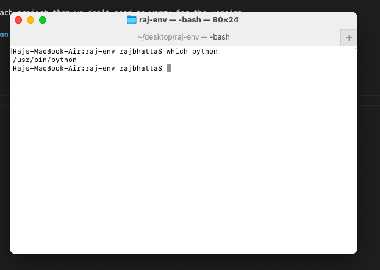
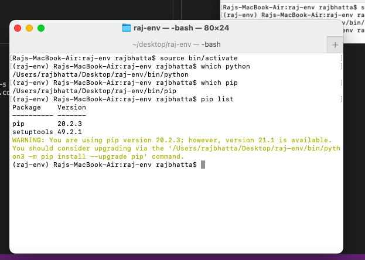
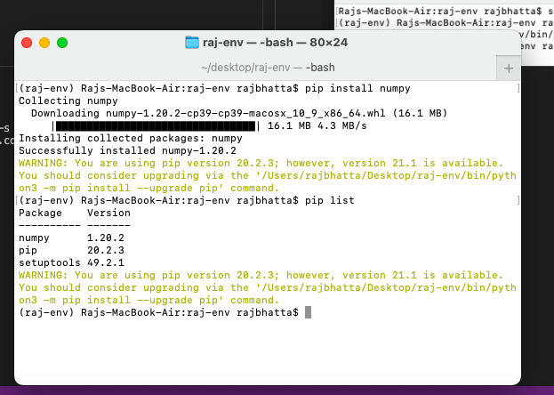

# 1. What is virtual environment in python #
- Way of sparating different python environment for different project
- Say we do have multiple python project and they are using different version of pyramid or flask then if we upgrade the central python environment then some of the module may not work.
- Therefore, if we create virutal environment for each project then we don't need to worry for the version.

# 2. Steps for creating virtual environment in python #

# 3. Activate python environment #

- <b>At this stage if we check python env then system is giving the default one </b>

<b> After activating the newly created environment, if we check python environment then system is giving the newly created environment<b>

<b> Even pip is locating newly created environment<b>

<b> Even pip list is showing two packages<b>

<b> After new installation we are having three packages<b>

# 4. Deactivating vitual environment #

