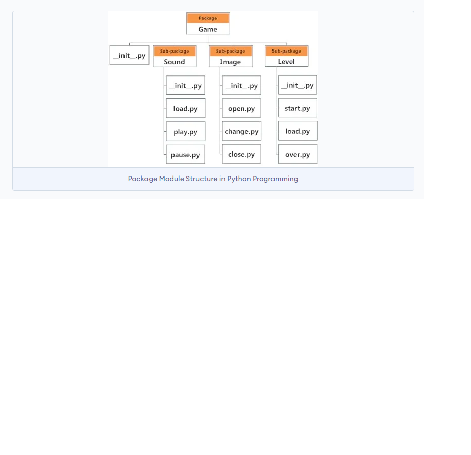

# What are the packages in Python ? #


## Importing module from a package ##
- We can import modules from packages using the dot (.) operator.

- For example, if we want to import the start module in the above example, it can be done as follows:

```python
import Game.Level.start
```

- Now, if this module contains a function named select_difficulty(), we must use the full name to reference it.

```python
Game.Level.start.select_difficulty(2)
```

or 

```python

import Game.Level.start as start
```

- Now, if this module contains a function named select_difficulty(), we must use the full name to reference it.

```python
start.select_difficulty(2)
```

# What is module in python ? #
- Module is a single python file containing class, method, variable. 


# Naming convention for python package #
```js
- Never use like this : Package/Sub-package/....
- Use like this: package/subpackage/...
```